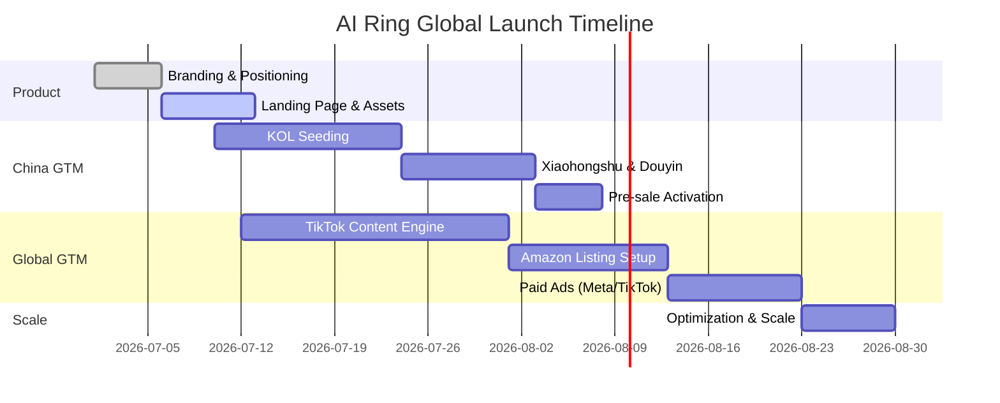

# AI-Ring-Launch-OS
# 💍 AI Ring Global Commercialization OS


---

## 🌍 Overview

> Building a repeatable **Global Commercialization System** for AI Ring within 45 days.

This document is not a marketing plan.

It is an **end-to-end Go-To-Market Operating System** covering:

- Product readiness
- Supply chain execution
- China launch strategy
- Global launch strategy
- Conversion funnel design
- Growth system (organic + paid)
- Risk control & execution dependencies

---

## 🧠 System Architecture

```text
                    AI Ring Launch OS
                             │
        ┌────────────────────┴────────────────────┐
        │                                         │
 Product Readiness                        GTM Readiness
        │                                         │
   ┌──────────────┐                     ┌──────────────┐
   │              │                     │              │
Branding   Supply Chain        China Launch   Global Launch
                                              │
                           ┌──────────────────┴──────────────────┐
                           │                                     │
                    Earned Media                          Paid Growth
                           │                                     │
            KOL / KOC / PR / Community     Ads / RTB / Live / Search
                           │                                     │
                           └──────────────┬──────────────────────┘
                                          │
                                Conversion Funnel
                                          │
                     Landing Page / Amazon / TikTok Shop
                                          │
                           Review → Retention → Scale
```

---

## 🗓️ 45-Day Launch Timeline



---

## 🚀 Go-To-Market System

### 🇨🇳 China Launch (Demand Creation)

**Earned Media System**
- KOL / KOC seeding
- Xiaohongshu lifestyle content
- Douyin short video viral loops
- Community discussion & UGC

Flow:

```text
Content Seeding → Social Proof → Interest Capture → Pre-sale Conversion → UGC Loop
```

---

### 🌍 Global Launch (Revenue System)

**Paid + Organic Hybrid System**

- TikTok organic content engine
- Influencer seeding (micro + mid-tier)
- Amazon listing + PPC
- Shopify landing page funnel
- Retargeting ads (Meta / Google / TikTok)

Flow:

```text
TikTok Content → Landing Page → Email Capture → Amazon / Shopify → Review → Retargeting → Scale
```

---

## ⚠️ Key Risks & Dependencies

> [!WARNING]
> Domestic crowdfunding compliance must be reviewed before launch.

> [!IMPORTANT]
> Overseas warehouse selection impacts delivery time, return cost, and ad scaling efficiency.

> [!TIP]
> Media seeding should begin at least 10–14 days before paid traffic activation.

---

## 📦 Critical Open Questions

- Should we adopt crowdfunding or direct pre-sale model in China?
- Amazon launch: Day 1 or after TikTok traction?
- TikTok Shop vs Shopify priority?
- Overseas warehouse: US / EU / HK hub strategy?
- Budget split between earned media vs paid growth?
- Return & reverse logistics strategy?

---

## 📊 Execution Progress

Overall System Readiness

██████████░░░░░░░░░░

~40%

---

## 🎯 Objective

Deliver a globally scalable AI hardware launch system that connects:

**Product → Content → Conversion → Scale**

within 45 days.
