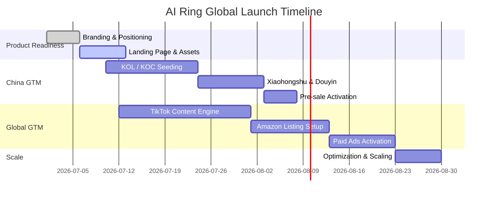

# 💍 AI Ring Global Commercialization OS


---

## 🌍 Overview

> A unified **【Global Commercialization System】** for launching AI Ring within 45 days.

This document is not a marketing plan.

It is an **end-to-end Go-To-Market Operating System (GTM OS)** covering:

- Product Readiness
- Supply Chain Execution
- China Go-To-Market Strategy
- Global Go-To-Market Strategy
- Demand Generation → Paid Growth Engine
- Risk & Execution Dependencies

---

## 🧠 System Architecture

```text
                    AI Ring Global Commercialization OS
                             │
        ┌────────────────────┴────────────────────┐
        │                                         │
 Product Readiness                          GTM Readiness
        │                                         │
   ┌──────────────┐                     ┌──────────────┐
   │              │                     │              │
Branding   Supply Chain        China GTM        Global GTM
                                              │
                           ┌──────────────────┴──────────────────┐
                           │                                     │
                    Demand Generation                     Paid Growth
                           │                                     │
        ┌──────────────────┼──────────────────┐      ┌───────────┼───────────┐
        │                  │                  │      │           │           │
 Creator Ecosystem   Tech Media      AI Search     Ads        RTB    Livestreaming..
 (KOL / KOC)         & PR            Visibility   (TikTok / Meta / Google)
        │                  │                  │
        └──────────────────┴──────────────────┘
                           │
                    Community & UGC Flywheel
                           │
              Landing Page / Amazon / TikTok Shop
                           │
                 Review → Retention → Scale
```

##### ( notes: PR:36氪/极克公园-"最近深圳有一家AI创业公司做了一个情侣AI戒指。"； Community：类似海外Reddit等）
---

## 🗓️ 45-Day Launch Timeline



---

## 🚀 Go-To-Market System

### 🇨🇳 China GTM (Demand Creation)

**Demand Generation System**

- KOL / KOC seeding (via 30 free samples for KOL/KOC with purchase link 蒲公英等平台 + 定向达人合作)
- Redbook lifestyle content seeding/ livestreaming (eg. DJI）
- Douyin short video viral loop strategy
- Community & UGC flywheel（用户内容 + 社交裂变）
- AI Search Visibility (GEO / AEO)
  - 豆包 / Kimi / 元宝 / 通义千问 / ChatGPT 等AI平台推荐优化

Flow:

```text
Content Seeding → Social Proof → Interest Capture → Pre-sale Conversion → UGC Flywheel
```

---

### 🌍 Global GTM (Revenue Engine)

**Hybrid Growth System**

- TikTok organic content engine
- Influencer seeding (micro / mid-tier creators)
- Amazon listing + PPC
- Shopify funnel system
- Retargeting (Meta / Google / TikTok)
- AI Search Visibility (ChatGPT / Claude / Gemini / Perplexity)

Flow:

```text
TikTok Content → Landing Page → Email Capture → Amazon / Shopify → Review → Retargeting → Scale
```

---

## ⚠️ Key Risks & Dependencies

> [!WARNING]
> Domestic pre-sale / crowdfunding compliance must be validated before launch.

> [!IMPORTANT]
> Overseas warehouse selection directly impacts delivery speed, CAC efficiency, and return cost structure.

> [!TIP]
> Demand generation (KOL + seeding) should start 10–14 days before paid media activation.

---

## 📦 Critical Open Questions

- Pre-sale model: crowdfunding vs direct pre-order?
- Amazon timing: Day-1 launch vs post-TikTok validation?
- TikTok Shop vs Shopify prioritization?
- Overseas warehouse: US / EU / HK hub strategy?
- Budget allocation: earned vs paid split?
- Reverse logistics & return handling strategy?

---

## 📊 Execution Readiness

Overall System Readiness

██████████░░░░░░░░░░

~40%

---

## 🎯 Objective

Deliver a globally scalable **AI hardware commercialization system** that connects:

**Product → Demand → Conversion → Retention → Scale**

within 45 days.
