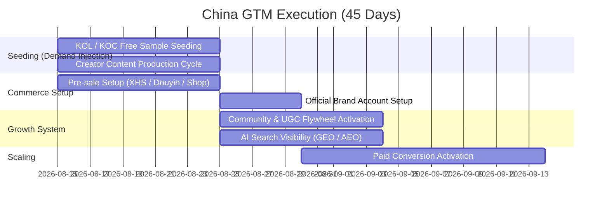
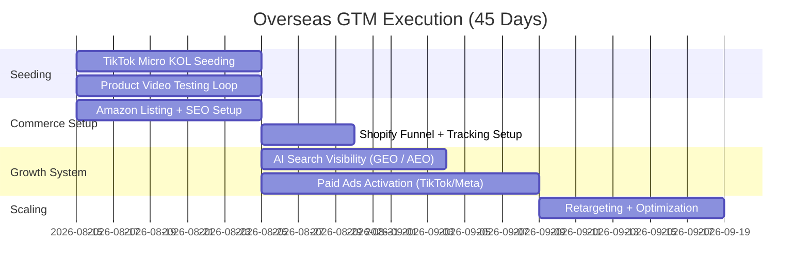

# 💍 AI Ring Global Commercialization OS


---

## 🌍 Overview

> A unified **Global Commercialization System** for launching AI Ring within 45 days.

This document is an end-to-end Go-To-Market execution system covering:

- Product Readiness (wpm)
- Supply Chain Execution (wpm)
- China Go-To-Market Execution
- Overseas Go-To-Market Execution
- Demand Generation → Paid Growth Engine
- Risk & Execution Dependencies

---

## 🧠 System Architecture

```text
                    AI Ring Global Commercialization OS
                             │
        ┌────────────────────┴────────────────────┐
        │                                         │
 Product Readiness                          GTM Execution Layer
        │                                         │
   ┌──────────────┐                     ┌──────────────┐
   │              │                     │              │
Branding   Supply Chain           China GTM        Overseas GTM
                                              │
                           ┌──────────────────┴──────────────────┐
                           │                                     │
                    Demand Generation                     Paid Growth
                           │                                     │
        ┌──────────────────┼──────────────────┐      ┌───────────┼────────────┐
        │                  │                  │      │           │            │
 Creator Ecosystem   Tech Media        AI Search   RTB / Ads   Shopify / SEO / Amazon / PR
 (KOL / KOC)         & PR              Visibility   (TikTok / Meta / Google)
        │                  │                  │
        └──────────────────┴──────────────────────────────────────────────────┘
                           │
                    Community & UGC Flywheel
                           │
                 Review → Retention → Scale
```

---

## 🗓️ 45-Day Execution Timeline (Start: 2026-08-15)

> Product readiness is completed before Day 0 (not included in execution timeline)

---

## 🇨🇳 China GTM (Day 0–45 Execution Plan)



---

## 🇨🇳 China GTM Execution Details

### 1️⃣ Seeding (Demand Injection)

- Deliver 30 KOL/KOC samples (TikTok / Xiaohongshu)
- Use 蒲公英 + direct outreach to secure creators
- Provide content scripts + key selling points
- Ensure 10–15 short videos posted within 10 days
- Focus:情侣互动 / AI情感 / wearable novelty

---

### 2️⃣ Commerce Setup

- Launch pre-sale pages (XHS / Douyin / Shopify)
- Set product links for all creators
- Confirm pricing + refund policy (50 RMB / deposit logic)
- Prepare livestream selling scripts (reference DJI-style launch)

---

### 3️⃣ Community & UGC Flywheel

- Create WeChat / Xiaohongshu community entry funnel
- Incentivize UGC posting (coupon / refund / rebate mechanism)
- Require hashtag usage + content repost loop
- Goal: convert buyers → content creators

---

### 4️⃣ AI Search Visibility (GEO / AEO)

- Optimize product description for AI assistants:
  - 豆包 / Kimi / 元宝 / 千问 / ChatGPT
- Seed Q&A content in:
  - Zhihu / Xiaohongshu / forums
- Positioning keywords:
  - “情侣AI戒指”
  - “AI wearable gift”
  - “emotion tracking wearable”

---

## 🌍 Overseas GTM (Day 0–45 Execution Plan)



---

## 🌍 Overseas GTM Execution Details

### ⚡ Phase 1 — Short-term Validation (0–45 days)

**Goal: Validate market fit + messaging + CAC efficiency**

- Competitor benchmarking (pricing / positioning / viral hooks)
- TikTok / Instagram / YouTube Shorts content testing
- Influencer seeding:
  - tech reviewers
  - wearable creators
  - 情侣礼物类博主
- Reddit / Product Hunt feedback loop
- Kickstarter / Indiegogo test (optional validation channel)
- Meta / TikTok small-budget ad testing (creative A/B test)

---

### 🌱 Phase 2 — Long-term Growth System

**Goal: Build scalable global revenue engine**

- Shopify independent store (core conversion hub)
- SEO system (review / comparison / blog content)
- Amazon long-term ranking + PPC system
- PR system (Tech media exposure)
- Community system (Discord / Reddit / Instagram)
- Affiliate marketing system (creator-based distribution)
- Retention system (email + remarketing + app later stage)

---

## 🔁 Core System Flow

```text
Competitor Research & Positioning
        ↓
Short Video Seeding (TikTok / IG / Shorts)
        ↓
KOL Testing Content
        ↓
Paid Ads (RTB / Meta / TikTok)
        ↓
Landing Page / Shopify Funnel
        ↓
Amazon / SEO / PR / Community
        ↓
Reviews & Social Proof
        ↓
Retargeting Loop
        ↓
Scale
```

---

## ⚠️ Key Risks & Dependencies

> [!WARNING]
> Domestic pre-sale compliance must be confirmed before execution.

> [!IMPORTANT]
> Overseas warehouse selection impacts CAC, delivery time, and return cost structure.

> [!TIP]
> Seeding phase must start at least 10–14 days before paid media scaling.

---

## 📦 Critical Open Questions

- Pre-sale model: crowdfunding vs direct pre-order?
- Amazon launch timing: Day 1 vs post-validation?
- TikTok Shop vs Shopify priority?
- Warehouse strategy: US / EU / HK hub?
- Budget split: earned vs paid?
- Return / reverse logistics handling model?

---

## 📊 Execution Readiness

Overall System Readiness

██████████░░░░░░░░░░

~40%

---

## 🎯 Objective

Deliver a globally scalable AI hardware commercialization system that connects:

**Product → Demand → Conversion → Retention → Scale**
